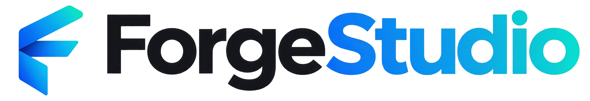

<h1 align="center">
  <picture>
    <source media="(prefers-color-scheme: dark)" srcset="branding/lockup-on-dark.png">
    
  </picture>
</h1>

A lightweight desktop studio for AI coding agents, with built-in Android and Flutter tooling. Chat with Claude Code, Codex or any CLI agent (or the built-in API-key engine), then switch between three workspaces: **Agent** (chat, tasks and live website preview), **Editor** (a familiar IDE layout with explorer, search and Git) and **Android / Flutter** (Gradle or Flutter builds, hot reload, new-app wizards, live phone screen and logs). The agent comes with you in every mode.

It uses only the Python standard library and plain HTML/CSS/JS with no build step, and runs as a desktop web app (Chromium app window, installable PWA, optional LAN access).

## Requirements
- **Linux or macOS** with Python 3.8+ and a browser (Chrome / Chromium / Edge / Brave for an app window). macOS support is new and less tested than Linux; on Windows, use WSL2.
- Everything else is optional and can be installed from **Settings → Setup**, which opens on first launch: one click per tool, the latest version from the official source, into your home folder (no admin password):
  - **Agents:** Claude Code (recommended) or Codex. Or skip CLIs and use the built-in engine with an API key.
  - **Android:** a JDK (Temurin 21) and the Android SDK (command-line tools, platform-tools, build-tools, newest platform). **Android Studio isn't needed.** Gradle needs no install: projects get a checksum-verified Gradle wrapper that downloads it on the first build.
  - **Flutter:** the latest stable Flutter SDK (into `~/.local/flutter`, linked as `~/.local/bin/flutter`). Android targets also use the JDK and Android SDK above; Linux desktop targets need a few system packages (a copyable command is shown).
  - **Extras:** Node.js LTS (dev-server previews), [scrcpy](https://github.com/Genymobile/scrcpy) (live phone screen). Git comes from your system (a copyable command is shown).

## Install
```sh
curl -fsSL https://raw.githubusercontent.com/DrBrainlessLol/ForgeStudio/main/install.sh | sh
```
Works on Linux and macOS. Installs the latest release for your user into `~/.local` (no root, nothing else installed, checksum verified; on macOS it also adds **Forge Studio.app** to `~/Applications`), then start **Forge Studio** from your app menu or run `forge-studio`. It opens in the browser you already have. Run the same line again to update; add `-s -- --uninstall` after `sh` to remove it (your data is kept). Prefer a package? See [Install / packaging](#install--packaging).

## Launch
- Desktop / app menu: **Forge Studio**
- Terminal: `forge-studio` or `forge-studio ~/path/to/project`
- Android Studio: **Tools → External Tools → Open in Forge Studio**
- Other devices: **Settings → Web App → Use from phones and other computers** (port 8766, needs the link with its token)

> Forge Studio is an independent project. It works with Claude Code, Codex, Gemini CLI and other coding agents, but it is **not made by, affiliated with or endorsed by** Anthropic, OpenAI, Google or any other AI provider. Their names and products are trademarks of their respective owners.

## Workspaces
Switch at the top of the window (or **Ctrl+1 / 2 / 3**). The agent chat comes with you in every mode; in Editor and Android it docks on the right and **Ctrl+J** (or the panel buttons) hides or shows it. Switch projects from the title bar.
- **Agent**: projects and running/finished agent tasks on the left, the chat in the middle (a "What should we build?" home screen with suggestions when it's empty), and Preview / Processes on the right.
- **Editor**: a familiar IDE layout. Explorer, search and source control on the left, tabbed code editor in the middle, the agent docked on the right.
- **Android**: a run bar (module, debug/release, device, Run / Restart / Stop / Build), then **Run & Logcat** (screen mirror + app logcat), **Build** output, **Gradle** tasks and toolchain, and **Devices** (emulators, Wi-Fi pairing, port forwarding).
  - **New app** (Android or Flutter) creates a Compose or Views app with Kotlin DSL, a version catalog, Git and a real Gradle wrapper (AGP 9.4.1 with built-in Kotlin, Gradle 9.6, compileSdk = the newest installed platform).
  - Projects without `gradlew` get an **Add Gradle wrapper** button.
  - Gradle runs on a JDK it supports, picked automatically (e.g. JDK 17 or 21 for older Gradle versions even if Android Studio's bundled JDK is newer).
  - **Live screen**: the phone's display streams as H.264 from its hardware encoder (via your installed scrcpy) and is decoded in the browser, up to 120 fps. Click to tap, drag to swipe; screenshots are the fallback without scrcpy.
  - App-only logcat with level/search filters, crash and ANR detection with **Ask to fix**, and **Ask** to send the visible log to the agent.
  - The tab only appears for Android Gradle and Flutter projects, and is labelled **Flutter** when a Flutter project is selected.
- **Flutter** (the same workspace, for projects with a Flutter `pubspec.yaml`):
  - The device menu lists everything `flutter devices` sees (phones, emulators, Linux/macOS desktop, Chrome) plus a **Web server** device whose app opens in **Preview**.
  - **Run** in debug, profile or release mode, then **hot reload** (⚡), **hot restart** and **stop**. With **Reload on save**, saving a `.dart` file in `lib/` hot reloads the app, whether you or the agent changed it.
  - The app's output (print, framework errors) streams next to the live screen. Flutter errors and failed runs get **Ask to fix**; logcat is one click away for Android devices.
  - Debug toggles while the app runs: debug paint, performance overlay, slow animations, debug banner, widget select, and **DevTools** connected to the app.
  - The **Flutter** tab runs any `flutter` / `dart` command (pub get/upgrade/outdated, analyze, test, format, build apk/appbundle/web/desktop, build_runner, doctor), adds pub.dev packages and adds platforms to an existing app.
  - **New app → New Flutter app** (also on the welcome screen and in the project menu) runs `flutter create` (counter or empty template, the platforms you pick), fetches packages and initialises Git.

The status bar shows the Git branch, the project, the agent's state and (in Android mode) the device and Gradle version.

## Agents
| Agent | Support |
|---|---|
| **Claude Code** (recommended) | Streaming, approval prompts, image input, chat resume, model providers |
| **Built-in (API key, no CLI)** | No CLI needed — talks to an Anthropic-style API directly with your own key. Read/Write/Edit/Bash tools, approvals, images, resume. |
| **Codex** | Native adapter: shell/file-change cards, image input, resume |
| Gemini CLI, Qwen Code, opencode, Cursor Agent, Aider | Detected automatically when installed; output streams into the chat |
| Custom | Settings → Agents → any command, with `{prompt}` and `{model}` placeholders |

The **Built-in** engine is what makes Forge Studio work standalone: pick it as the agent and select one of your own API-key providers in the model menu. It runs the whole agent loop in-process (Read/Write/Edit/Bash tools + approvals), so no coding CLI has to be installed. It speaks **both** API shapes:
- **OpenAI Chat Completions** — OpenAI, OpenRouter (GPT, Gemini, Llama…), DeepSeek, Groq, Ollama, or any OpenAI-compatible endpoint.
- **Anthropic Messages** — Anthropic, Kimi, GLM, or any Anthropic-compatible endpoint.

Each provider has an **API style** setting in Settings → Models & Keys; the presets set it for you.

## Editor mode: code & Git

A built-in editor and Git client, no external tools bundled:
- **Explorer**: lazy-loading file tree with Git status colors, new file/folder, rename (F2), delete (to Trash), drag-to-move, and a right-click menu (copy path, open/download, ask the agent).
- **Editor**: multi-tab, per-file undo, syntax highlighting for common languages (including Dart), auto-indent, Tab/Shift+Tab, Ctrl+/ to comment, Ctrl+S to save (with a stale-file conflict prompt), and a status bar (line/column, language, branch).
- **Search** (Ctrl+Shift+F): project-wide, case/regex toggles, grouped results.
- **Quick open** (Ctrl+P): fuzzy file finder.
- **Source Control** (Ctrl+Shift+G): stage/unstage/discard, commit (uses your profile name/email when Git has no identity), branch switch/create, pull/push/fetch, diffs, and recent commits. Initialize or clone a repo from here. The button in the commit box drafts a commit message from your changes with your configured model.
- **Ask agent**: send the open file or the selected lines to the agent.
- **Clone / New project**: from the sidebar ＋ (right-click) or the welcome tiles.
- When the agent edits files in the open project, the editor reloads them live and the Git panel updates.

## Install / packaging
The [one-line installer](#install) is the easiest way. Packages are also attached to every [GitHub release](https://github.com/DrBrainlessLol/ForgeStudio/releases) (built with `packaging/build.sh` into `packaging/dist/`):
- **Debian / Ubuntu / Deepin:** `sudo apt install ./forge-studio_1.0.0_all.deb`
- **Arch:** `sudo pacman -U forge-studio-1.0.0-1-any.pkg.tar.zst` (or `makepkg -si` with the `PKGBUILD`)
- **Fedora / openSUSE:** build the RPM with `forge-studio.spec`
- **Any distro:** extract `forge-studio-1.0.0.tar.gz` and run `sudo ./install.sh` (or `./install.sh --user`)

See `packaging/README.md` for details.

## Access on other devices
- The token lives in `~/.config/forge-studio/token`. Settings → Web App shows it and a copy button.
- On this computer the page authorises itself automatically (loopback only), so a bookmark or the installed app opens straight to sign-in.
- On another device: turn on network access in Settings → Web App, open the link it shows, or paste the token on the first screen. Give every profile a PIN first.

## Permissions (Claude Code)
- **Ask before acting**: every non-read action becomes a card in the chat.
- **Auto-edit, ask for commands**, **Auto**, **Full access — never ask**, **Plan only**.
- Approval cards highlight risky actions: recursive deletes, sudo, force-push, `curl | sh`, installs, changes outside the project, and so on.
- Each card offers **Allow**, **Always Allow** or **Deny**.

## Chat
- Attach images and files with the clip, by pasting, or by drag & drop. Images go to the model directly; other files are passed as paths.
- Files the agent writes get **Open / Download** buttons, and file paths in replies get a download link.
- **History** lets you reopen, rename and delete conversations. They're per profile.
- **Tasks** in the Agent sidebar show which chats are working and which just finished, across projects.
- Tool cards expand to the full command and output, with copy buttons. Long chats show the latest 150 messages with **Show earlier messages** to load more, so they open quickly.
- **Notifications**: a short chime and, when Forge Studio isn't the active window, a system notification when the agent needs approval, a task finishes, a Gradle build ends or your app crashes. Each can be turned off in Settings → General.

## Plugins
Settings → Plugins installs plugins from a folder or a Git URL, or scaffolds a new one. A plugin is a folder with `.claude-plugin/plugin.json` and optional `commands/`, `agents/`, `skills/`, `.mcp.json` and `README.md`. Claude Code loads them natively; the built-in engine supports commands, agents and skills (not MCP). They live in `~/.config/forge-studio/plugins`.

## Profiles & settings
- **Profiles**: local (optional PIN) or Google sign-in (one-time Desktop-app OAuth client setup).
- **Settings** sections:
  - General: light / dark (AMOLED) / auto, accent color, density, default permissions, notifications and sound, hiding test profiles.
  - Profile & Account (including marking a profile as a test profile).
  - Agents.
  - Plugins.
  - Models & Keys: your own Anthropic key, DeepSeek, OpenRouter, Kimi, GLM, Ollama, or custom.
  - Web App.
  - Android.

## Preview
- **Preview** (Agent mode): static server with live reload, or any dev command (URL auto-detected, `npm install` on first run). Device sizes are available. For a Flutter project, **Start** runs the web app (`flutter run -d web-server`) with hot reload from Flutter mode.
- **Processes** lists dev servers, Gradle and Flutter builds, Flutter runs, logcat, emulators and clones, with their logs.
- Android Studio doesn't need to be open for anything in Android mode; **Smooth window** also opens scrcpy in its own window.

## Notes
- Data lives in `~/.config/forge-studio/`: token, config, and `profiles/<id>/` with chats, uploads and keys (mode 600).
- Server log: `~/.config/forge-studio/server.log`. Port: `FORGE_STUDIO_PORT` (default 8765; LAN uses +1).

## License
Copyright © 2026 DrBrainlessLol.

Forge Studio is free software under the [GNU Affero General Public License v3.0](LICENSE) (AGPL-3.0-only). You can use, study, change and share it. If you distribute a modified version, or let other people use a modified version over a network, you must make your source code available under the same license.

**Commercial licenses** are available for companies that want to use or embed Forge Studio without the AGPL's obligations. Open an issue or contact the maintainer on GitHub.

Contributions are welcome. See [CONTRIBUTING.md](CONTRIBUTING.md). First-time contributors sign a short [Contributor License Agreement](CLA.md). Third-party material is listed in [THIRD_PARTY_NOTICES.md](THIRD_PARTY_NOTICES.md).
